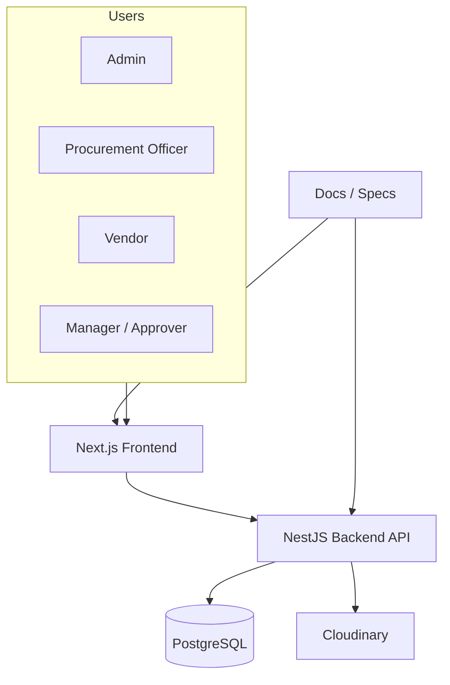
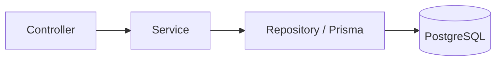
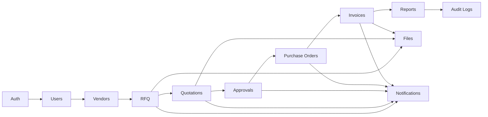
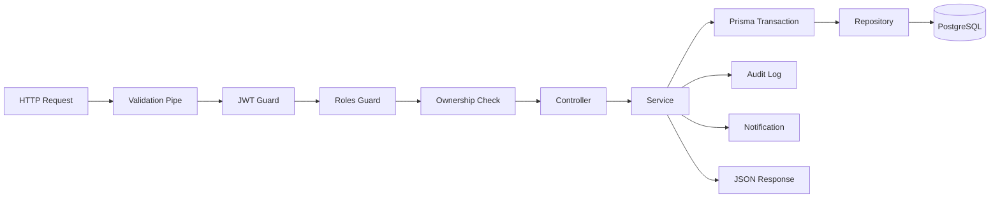
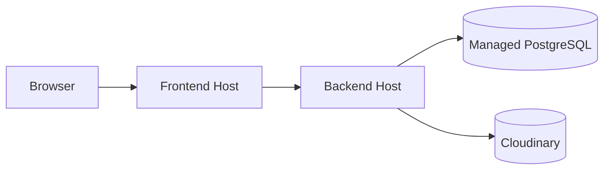

# Architecture

VendorBridge is designed as a modular monolith. That is the right tradeoff for a workflow-heavy ERP: it keeps procurement rules centralized, preserves transactional integrity, and avoids the operational cost of microservices before the domain stabilizes.

This document explains not only what the system contains, but why the boundaries are drawn the way they are.

The purpose of this document is to help engineers, reviewers, and future automation agents understand the system shape quickly enough to make safe changes without re-learning the domain every time.

## Architecture goals

- Keep workflow integrity above all else.
- Make each module independently understandable.
- Keep the backend as the source of truth.
- Separate business rules, transport concerns, and persistence concerns.
- Keep the UI thin, reusable, and easy to evolve.
- Make the codebase navigable by folder structure alone.
- Preserve auditability and security at every critical step.
- Make procurement decisions observable from request to persistence.
- Keep report data tied to real operational records.
- Avoid hidden coupling between procurement stages.
- Support future growth without forcing a rewrite.

## System view

The frontend is responsible for presentation, navigation, and user interaction. The backend is responsible for authentication, authorization, workflow state changes, persistence, notifications, and audit records. The documentation set is intentionally treated as part of the system because this project relies on rule clarity.

In practice, that means the browser can request an action, but it cannot decide whether the action is allowed. The API must always confirm role, ownership, deadline, and workflow state before anything changes.

## Architecture layers

### Layer responsibilities

- Controllers accept requests, validate input, and delegate work.
- Services own business rules, workflow transitions, and transaction boundaries.
- Repositories only query and persist data.
- Cross-cutting concerns live in shared modules under `src/common`.
- The Prisma layer is the only place that should know the physical table layout.
- The service layer is the only place that should know why a workflow action is valid.

### What should not happen

- Controllers should not decide procurement rules.
- Services should not depend on HTTP details.
- Repositories should not decide access policy.
- The frontend should not enforce security as if it were the backend.
- Audit logging should not be scattered as optional UI behavior.
- Report queries should not become a second source of truth for operations.

## Backend module map

The backend is organized by business capability.

| Module | Responsibility | Typical outcomes |
|---|---|---|
| Auth | signup, login, refresh, logout, password recovery | authenticated session, token rotation |
| Users | user lifecycle and role management | user admin, access control |
| Vendors | vendor lifecycle, search, ownership-scoped views | vendor onboarding, vendor status tracking |
| RFQ | draft, publish, close, cancel, vendor assignment | structured procurement request |
| Quotations | submission, edit, shortlist, reject, compare | vendor response management |
| Approvals | approval decisions, remarks, state changes | controlled business decision |
| Purchase Orders | PO generation, lifecycle, printable output | official procurement document |
| Invoices | invoice generation, print, email, overdue checks | billing artifact and delivery |
| Notifications | in-app notifications and future channels | operational awareness |
| Audit Logs | immutable audit trail, query/export support | compliance record |
| Reports | dashboard analytics and procurement summaries | insight and trend data |
| Files | Cloudinary uploads and metadata ownership | attachments and documents |

### Module design rules

- Each module should expose a public service or API surface, not internal repositories.
- Module boundaries should match business boundaries, not technical layers.
- State changes must be contained within the owning module.
- Shared utilities belong in `src/common`, not in feature modules.
- Modules may call other modules only through a deliberate public contract.
- A module should never reach into another module’s private persistence layer.

### How the modules relate to each other

The domain is sequential, so module boundaries reflect the procurement lifecycle:

This is not a hard runtime dependency graph for every method call. It is a business dependency map that shows which stage depends on which earlier stage existing correctly.

## Request lifecycle

### Why this pipeline matters

The pipeline ensures that the application does not become “UI-driven business logic.” Every meaningful state change is validated, authorized, committed, and audited before the user sees success.

It also protects against the most common ERP failure mode: data being visually updated in one screen while the actual business record is still invalid in the database.

## Frontend structure

The frontend uses Next.js App Router and is organized by route groups and feature pages.

Important routes in this repo include:

- `/login`
- `/forgot-password`
- `/dashboard`
- `/vendors`
- `/rfqs`
- `/quotations`
- `/quotations/compare/[rfqId]`
- `/approvals`
- `/purchase-orders`
- `/invoices`
- `/notifications`
- `/activity`
- `/reports`

### Frontend responsibilities

- Present the current state of the workflow.
- Show only the actions available to the current role.
- Use typed API calls and schema-driven forms.
- Keep client state lightweight and ephemeral.
- Never duplicate business rules that already belong on the backend.
- Use route groups to separate vendor, staff, and public flows.
- Treat dashboard widgets as views over backend state, not independent business objects.

### Frontend route philosophy

The frontend should mirror the business process, not invent its own. For example:

- Dashboard shows summary state and work queues.
- RFQ routes deal with request creation, publication, and closure.
- Quotation routes deal with vendor responses and comparison.
- Approval routes deal with approvals and rejection remarks.
- Invoice routes deal with document generation and delivery.

That keeps the navigation understandable and avoids hidden behavior in UI components.

## Data and storage model

- PostgreSQL stores all structured business data.
- Cloudinary stores uploaded file content.
- PostgreSQL stores file metadata and ownership references only.
- Audit logs are append-only and must not be mutated after creation.
- Reports should read from transactional tables rather than from duplicated summary tables unless there is a clearly justified performance reason.

### Data ownership by domain

| Domain | Primary ownership | Notes |
|---|---|---|
| Users | Auth and Users modules | identity, roles, lifecycle |
| Vendors | Vendors module | vendor profile and status |
| RFQs | RFQ module | request shape and vendor assignment |
| Quotations | Quotations module | pricing, submission state, comparison data |
| Approvals | Approvals module | decision records and remarks |
| Purchase Orders | Purchase Orders module | official document state |
| Invoices | Invoices module | totals, taxes, delivery state |
| Audit Logs | Audit Logs module | immutable event history |
| Notifications | Notifications module | delivery records and alert state |
| Reports | Reports module | read models derived from business tables |

### Data design rules

- Never store denormalized analytics if the same result can be derived from the source tables cheaply and safely.
- Never allow a document to exist without a parent workflow record.
- Never allow the file store to become a hidden database of business state.
- Never let report tables mutate core workflow truth.

## Integration points

| Integration | Purpose | Rule |
|---|---|---|
| Cloudinary | file uploads and document delivery | store metadata in DB only |
| Swagger | API discovery and manual testing | keep routes aligned with backend |
| PDF generation | invoices and purchase order output | render from typed data, not raw HTML |
| Email delivery | invoice sharing and notifications | failures must not block the parent transaction |

### Integration boundaries

- Cloudinary is an external storage provider, not a workflow engine.
- Swagger is a discoverability layer, not a product feature.
- PDF generation should receive already-validated domain data and should not make business decisions.
- Email delivery is a side-effect of business events, not the thing that defines the event.

## Deployment topology

For local development:

- PostgreSQL runs in Docker.
- Backend runs on port 4000.
- Frontend runs on port 3000.

For a normal deployment, the simplest useful shape is:

For deployment:

- Frontend can be hosted on a static or server-side platform.
- Backend can run as a single instance behind a reverse proxy.
- PostgreSQL should be managed and backed up separately.
- Cloudinary remains the file store.

## Why this structure works

- It keeps procurement logic in one place.
- It makes auditability easier because all critical changes happen in a single backend transaction.
- It lets the UI evolve without destabilizing the data rules.
- It scales the team better than a giant CRUD codebase.
- It keeps the system understandable for future contributors and automation agents.
- It keeps workflow state explicit, which makes debugging and testing much easier.
- It reduces the chance that a screen and the database drift apart.

## Failure model

The architecture is intentionally designed to fail in controlled ways:

- Validation failures should stop the request before persistence.
- Authorization failures should deny access before data is exposed.
- Transaction failures should roll back the whole business change.
- Notification failures should be logged and retried if needed, not silently ignored.
- Audit failures should be treated as critical because they break compliance traceability.

## Extension points

When the system grows, the safest extension points are:

- adding a new feature module that follows the existing controller-service-repository pattern,
- introducing a new report query that reads from existing operational tables,
- adding a new notification transport behind the notification service,
- adding a new document output format behind the PDF/document layer,
- adding background jobs for time-based workflow checks such as overdue invoices.

## What to avoid

- Do not split modules just because they are large; split them only when the business boundary becomes clearer.
- Do not move business decisions into utility helpers where they become hard to trace.
- Do not let front-end stores become shadow domain models.
- Do not create special-case code paths for UI convenience if they weaken the workflow rules.

## Related documents

- [DFDs.md](DFDs.md)
- [SYSTEM_FLOW.md](SYSTEM_FLOW.md)
- [SECURITY.md](SECURITY.md)
- [features.md](features.md)

## Operational notes

- Keep the backend stateful only where the business requires it.
- Keep client-side state focused on presentation and interaction.
- Use feature modules to isolate procurement behavior, not to hide it.
- Treat the documentation as a contract, not as marketing material.

## Change impact rules

When a future change affects a core workflow, check these questions first:

1. Does it alter a state transition?
2. Does it change who can act on the record?
3. Does it change what must be audited?
4. Does it change what reports should show?
5. Does it change how documents are generated or delivered?

If the answer to any of those is yes, the change should be treated as a workflow change rather than a simple UI tweak.