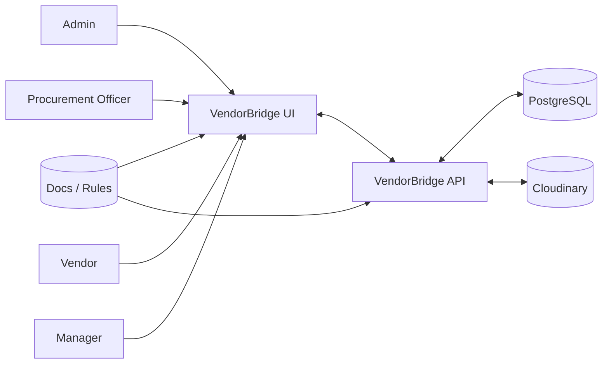
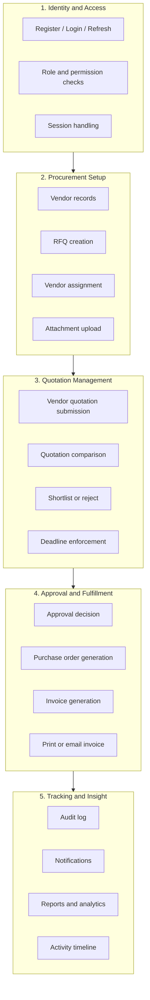
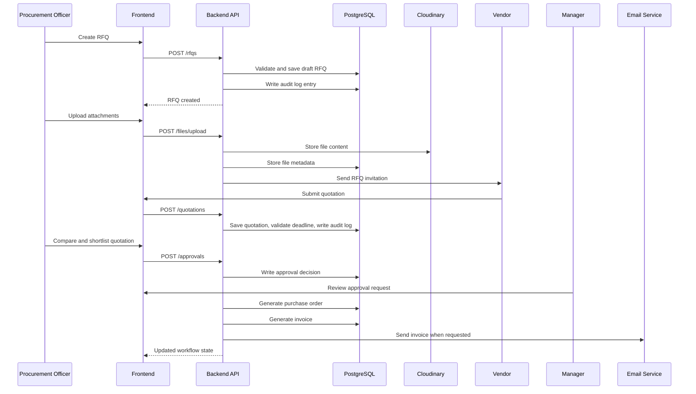
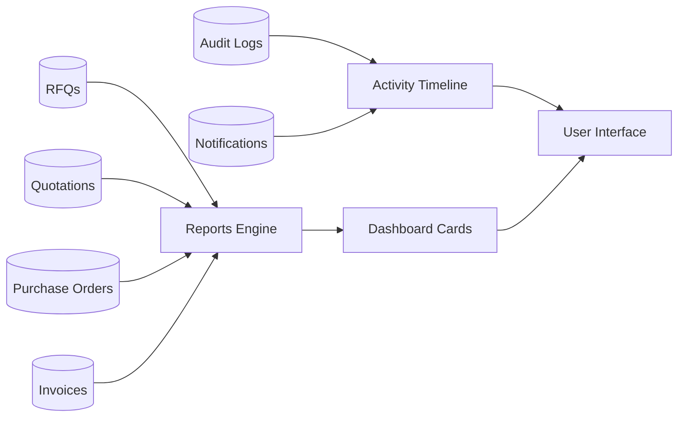

# Data Flow Diagrams

These diagrams explain how data moves through the VendorBridge system at a level that a product owner, designer, or developer can follow.

The important idea is that data does not move randomly. It moves through controlled business steps that preserve procurement integrity.

## Level 0: Context diagram

At the highest level, all human users interact with the UI, the UI communicates with the API, and the API is the only component that writes or reads the operational data stores.

## Level 1: Main business flows

## Level 2: RFQ to invoice data movement

## Level 3: Reporting and activity data flow

## Data stores and responsibilities

| Store | Stores | Does not store |
|---|---|---|
| PostgreSQL | users, vendors, RFQs, quotations, approvals, POs, invoices, audit logs, notifications, file metadata | binary file uploads |
| Cloudinary | file content and delivery URLs | workflow state |
| Session/JWT | login state and claims | business records |

## Data rules

- Every critical state change must create an audit log entry.
- Vendor-scoped data must remain isolated by ownership.
- Notifications should never block the main transaction.
- Files are references, not database blobs.
- Workflow transitions must be validated before persistence.
- Reports must read from actual transactional data, not manually edited summary records.

## What each flow protects

- Identity and access flow protects the system boundary.
- Procurement setup flow protects the structure of an RFQ.
- Quotation management flow protects deadline and response correctness.
- Approval and fulfillment flow protects the purchase chain.
- Tracking and insight flow protects traceability and accountability.

## Failure paths and recovery

The data flow model is only complete when failure behavior is included.

- Validation failure stops the request before any database write.
- Authorization failure prevents access to the record entirely.
- Deadline failure prevents stale quotations from being accepted.
- Notification failure should be logged but should not usually roll back the core procurement transaction.
- Audit failure should be treated as a critical defect because it breaks traceability.

## Why this matters for implementation

These diagrams give implementers a checklist for what a feature must do beyond its visible UI:

- write the correct record,
- create the correct audit trail,
- produce the correct downstream notifications,
- and keep reports and timelines consistent with the committed state.

## Expanded guidance and implementation checklist

The diagrams above are intentionally concise; this section explains how to interpret them when writing code, tests, or operational runbooks.

1) Request-to-persistence checklist (for each write operation)

- Validate input with the global validation pipe and DTO/Zod schema.
- Authenticate and authorise the request using `JwtAuthGuard` and `RolesGuard`.
- Perform ownership checks where records are vendor-scoped.
- Ensure the current state allows the requested transition (explicit state-check).
- Execute the change inside a Prisma transaction (`prisma.$transaction`) when the action touches more than one table (e.g., state change + audit + notification).
- Write an audit event describing the intent, actor, timestamp, and resulting state.
- Emit a notification record (in-app) and schedule any outbound transports (email) asynchronously.
- Return a stable JSON response with the updated resource and pagination where applicable.

2) Read endpoints and reporting

- Read endpoints should apply ownership filters at query time (e.g., `where: { vendorCompanyId: user.vendorCompanyId }`).
- For heavy reports, prefer server-side aggregation SQL queries with explicit time windows and pagination.
- Avoid building reports by iterating over many small queries; use grouped aggregations and indexes.

3) Audit & compliance

- Every business-significant mutation must call `AuditService.log({ event, actorId, resourceId, before, after, metadata })`.
- Do not expose the ability to delete or update audit records via any API.
- Ensure the DB migration that creates the `audit_logs` table also installs the immutability trigger and correct privileges.

4) Notifications and side effects

- Notifications are side-effects and must not roll back the parent transaction if they fail.
- Produce in-app notification records inside the transaction; schedule outbound transports (SMTP, webhook) using a background worker or retry queue.

5) File uploads

- Accept multipart upload on the API and stream directly to Cloudinary.
- Validate MIME type, maximum size, and ownership before creating the DB metadata row.
- Store checksum and publicId in the DB to prevent accidental duplicate uploads and to support later verification.

6) Failure modes and compensation

- If any precondition (state/ownership/deadline) fails, return a `4xx` error with a machine-readable `code` that maps to business rule documents (e.g., `BR-002: RFQ_DEADLINE_PASSED`).
- If a downstream transport fails (email, webhook), log and schedule a retry; do not roll back audit or DB state.
- If a DB transaction fails unexpectedly, surface a `5xx` error and include the `requestId` for tracing.

7) Monitoring and observability

- Emit structured logs at INFO for business events (RFQ_PUBLISHED, QUOTATION_SUBMITTED, APPROVAL_APPROVED).
- Log at WARN/ERROR for failures, including the request id and user id when available.
- Track metrics for API latency, transaction duration, and background job queues.

8) Performance and scaling notes

- Add DB indexes on filters used in list endpoints (status, vendorCompanyId, createdAt, rfqId).
- For large listing pages, enforce a max pageSize and use keyset pagination for heavy tables.
- If reports become slow, introduce read replicas and materialized views updated on a schedule.

9) Security mapping

- Map every endpoint to required roles in a central `routes` table for review.
- Use scoped refresh tokens and rotate them on use.
- Ensure `X-Request-Id` is present on incoming requests and propagated to logs.

10) Tests

- Unit test services for state transitions and business rule failures.
- Integration tests should boot the app with a test DB and verify end-to-end flows: create RFQ → submit quotation → approve → generate PO → invoice.
- Add an e2e test that verifies audit records are produced and that the immutability probe rejects update/delete attempts.

## Example API mapping (selected endpoints)

These are representative endpoints that map to the flows in the diagrams. Use these as the starting point for controller design.

- `POST /api/v1/rfqs` — create a draft RFQ (Officer)
- `POST /api/v1/rfqs/:id/publish` — publish RFQ after validation (Officer)
- `GET /api/v1/rfqs/:id` — get RFQ details (role-scoped)
- `POST /api/v1/quotations` — vendor submits quotation
- `GET /api/v1/quotations?rfqId=...` — list quotations for an RFQ
- `POST /api/v1/approvals` — create approval action (Manager)
- `POST /api/v1/purchase-orders` — generate PO (service-owned)
- `POST /api/v1/invoices/:id/send` — email invoice

## How to read the diagrams in practice

- Treat Level 0 as the stakeholder view: who talks to the system.
- Treat Level 1 as the process owner view: where decisions and handoffs occur.
- Treat Level 2 as the developer view: the exact calls and DB effects that need tests and transactions.
- Treat Level 3 (reporting) as the analytics/ops view: what must be exportable and observable.

## Appendix: common error codes (suggested)

Create a shared catalog of error codes mapped to business rules and HTTP codes. Examples:

- `BR-001` — `RFQ_MISSING_VENDOR` — 400 Bad Request
- `BR-002` — `RFQ_DEADLINE_PASSED` — 409 Conflict
- `BR-003` — `OWNERSHIP_DENIED` — 403 Forbidden
- `BR-004` — `INVALID_STATE_TRANSITION` — 409 Conflict
- `BR-005` — `AUDIT_LOG_WRITE_FAILED` — 500 Internal Server Error

Use these codes in API responses so UI and other systems can handle them deterministically.

---

If you want, I can now expand `SYSTEM_FLOW.md` and `features.md` to the same level of detail. Which file should I expand next? (I recommend `SYSTEM_FLOW.md` because it maps directly to UI screens and acceptance tests.)