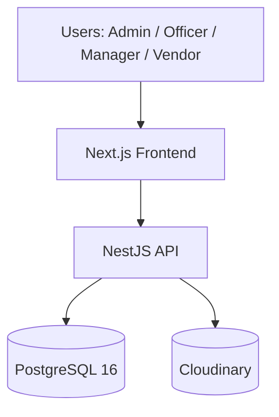

# VendorBridge

VendorBridge is a workflow-first Procurement & Vendor Management ERP designed to preserve procurement integrity while reducing manual overhead. It models procurement as an explicit, auditable sequence of steps from vendor onboarding through RFQs, quotations, approvals, purchase orders, invoicing, and reporting.

Core principles

- Workflow correctness over cosmetic UI changes — every transition is validated and recorded.
- Traceability and compliance — immutable audit logs capture all business-significant actions.
- Ownership and data isolation — vendor-scoped records are strictly partitioned by company and role.


## Product vision

VendorBridge replaces fragmented procurement workflows with a single authoritative system that enforces business rules and records intent. The system treats procurement as a sequence of guarded transitions (not merely CRUD), ensuring correctness, auditability, and operational safety.

Primary users

- Procurement Officer — creates RFQs, assigns vendors, evaluates quotations, and initiates POs.
- Vendor — views assigned RFQs and submits quotations and attachments before deadlines.
- Manager / Approver — reviews procurement requests and either approves or rejects them with mandatory remarks on rejection.
- Admin — manages users, roles, vendor records, and system-level reporting access.

## Repository layout

The repository holds the backend API, frontend UI, and the canonical documents needed for implementation, review, and operations.

Top-level structure

- `backend/` — NestJS API (TypeScript) with Prisma ORM and PostgreSQL migrations.
- `frontend/` — Next.js App Router UI (React + TypeScript).
- `doc/` — Product, architecture, security, and module specifications (authoritative design docs).
- `docs/` — Engineering supporting documents (test plan, deployment notes).
- `scripts/` — Convenience scripts for local development on Windows.


## Recommended reading order

1. [ARCHITECTURE.md](ARCHITECTURE.md) — high-level architecture and components.
2. [SYSTEM_FLOW.md](SYSTEM_FLOW.md) — user journeys and state machines for procurement flows.
3. [DFDs.md](DFDs.md) — data flow diagrams, event catalog, and persistence model.
4. [features.md](features.md) — feature inventory and screen-to-role mapping.
5. [SECURITY.md](SECURITY.md) — security controls, threat model, and operational guidance.

For deeper reference, consult `doc/` for module-level specifications and `docs/` for engineering process artifacts.

## Quick start (development)

Prerequisites

- Node.js 20+ (LTS), pnpm
- Docker (for running PostgreSQL in compose)

Backend (development)

```powershell
cd backend
pnpm install
docker compose up -d
pnpm prisma:generate
pnpm prisma:migrate:deploy
pnpm prisma:seed
pnpm start:dev
```

API: `http://localhost:4000/api/v1`
Swagger: `http://localhost:4000/api/v1/docs`

Frontend (development)

```powershell
cd frontend
pnpm install
pnpm dev
```

UI: `http://localhost:3000`

Quick helper (Windows)

```powershell
powershell -ExecutionPolicy Bypass -File scripts\run-all.ps1
```

This helper starts backend and frontend in separate windows and clears common ports.

## Architecture at a glance



## Source of truth

Code (the backend and schema) is the canonical source of truth for business rules. Documents describe intent, rationale, and examples; when a conflict exists, the implementation and migration history in `backend/prisma/migrations/` take precedence.

Primary artifacts

- `backend/prisma/schema.prisma` — authoritative data model
- `doc/` — design and module-level specs
- `docs/` — engineering and operations artifacts

## Stack overview

- Frontend: Next.js (App Router), React, TypeScript, Tailwind, shadcn/ui, React Hook Form, Zod, TanStack Query
- Backend: NestJS, TypeScript, Prisma ORM, PostgreSQL 16, JWT (RS256), argon2id password hashing
- Files: Cloudinary (uploads stored as external assets; DB stores metadata/pointers)
- Tooling: pnpm, Docker Compose, Jest, Supertest, ESLint, Prettier

## Delivery principles

- Workflow correctness over cosmetic improvements.
- Business rules implemented server-side; UI is a thin client.
- Immutable audit logs for compliance and traceability.
- Strict ownership and role-based access controls.
- Small, testable modules with clear responsibilities.

## Project boundaries

VendorBridge intentionally focuses on procurement workflows and avoids feature creep. It is not:

- a microservices-first architecture (v1 is a modular monolith)
- a full ERP for inventory/accounting
- a real-time websocket system in initial releases

Instead, VendorBridge provides a stable, auditable, and extensible procurement core.

---

If you want, I will commit these README changes and push them to a new branch `Arya` along with the repository markdown files. Confirm and I'll proceed (or I can proceed now). 
