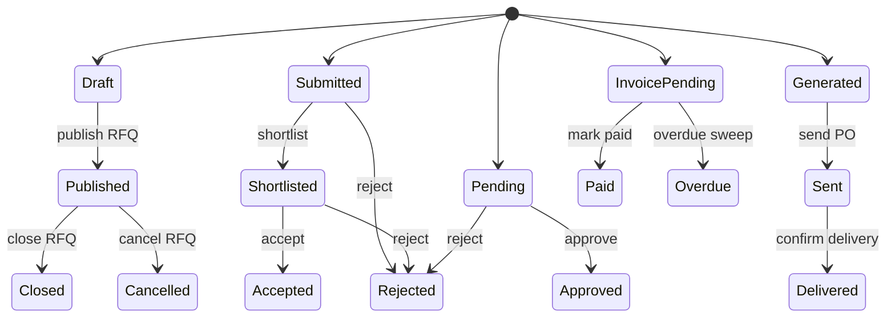
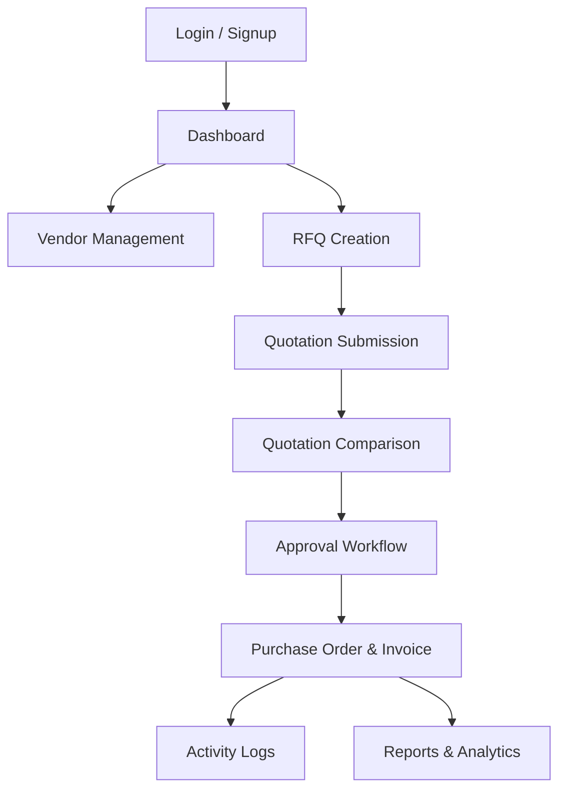
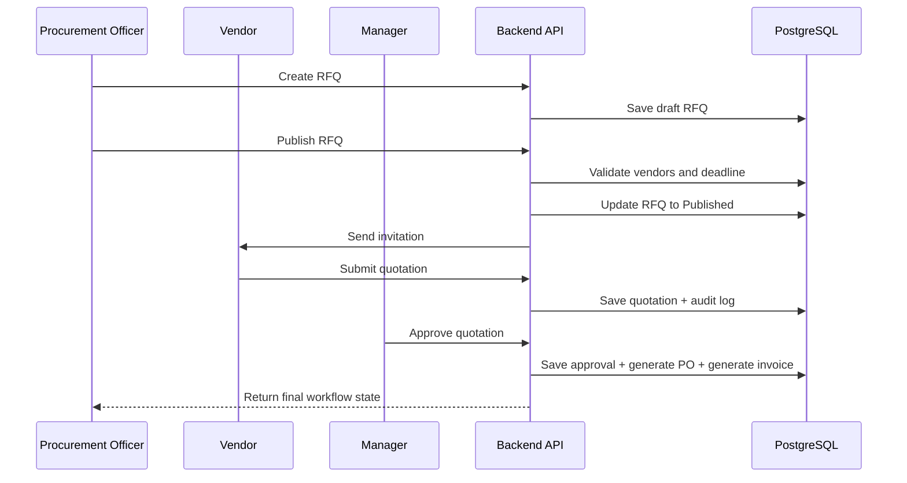

# System Flow

This document describes the end-to-end workflow of VendorBridge from login to reporting.

The main idea is that each screen reflects a stage in the business process, and each stage maps to a controlled backend transition.

## Main lifecycle

```mermaid
flowchart LR
  A[Login / Signup] --> B[Dashboard]
  B --> C[Vendor Management]
  C --> D[RFQ Creation]
  D --> E[Quotation Submission]
  E --> F[Quotation Comparison]
  F --> G[Approval Workflow]
  G --> H[Purchase Order Generation]
  H --> I[Invoice Generation]
  I --> J[Print / Email Invoice]
  J --> K[Activity Logs and Reports]
```

## What the user sees

The user experience is built around the current workflow state. The interface should answer three questions at every step:

1. What happened already?
2. What can I do next?
3. What is blocked until another role acts?

That makes the system feel operational rather than decorative.

## Role-based flow

### Procurement Officer

1. Signs in.
2. Reviews dashboard metrics and pending approvals.
3. Registers or updates vendors.
4. Creates an RFQ, assigns vendors, and sets the deadline.
5. Reviews incoming quotations.
6. Compares quotations and starts the approval process.
7. Generates the purchase order after approval.
8. Generates the invoice and sends or prints it.
9. Reviews activity logs and reports for follow-up.

### Vendor

1. Signs in to the vendor portal.
2. Views invited RFQs.
3. Submits or edits a quotation before the deadline.
4. Tracks RFQ status and purchase order status.
5. Receives relevant notifications.
6. Uses the portal as a response channel, not as a control point.

### Manager / Approver

1. Reviews submitted procurement requests.
2. Approves or rejects with remarks.
3. Triggers the transition into fulfillment.
4. Monitors workflow progress and audit trail.
5. Ensures the approval step is not bypassed.

### Admin

1. Manages users and roles.
2. Manages vendor access and system settings.
3. Reviews analytics and operational health.
4. Oversees audit and compliance visibility.
5. Handles exceptional operational cases.

## Core workflow rules

### Workflow rules that matter most

- RFQ must have vendors and a future deadline before publication.
- Quotation cannot be submitted after deadline.
- Vendor can edit quotation only before deadline.
- Approval requires a submitted quotation.
- Purchase order requires an approved quotation.
- Invoice requires a purchase order.
- Audit logs must be written for each major action.

## Business sequence

1. A procurement officer creates an RFQ.
2. Vendors receive invitations and submit quotations.
3. Procurement users compare quotations.
4. A manager approves or rejects the selected quotation.
5. An approved quotation produces a purchase order.
6. A purchase order produces an invoice.
7. The invoice can be printed or emailed.
8. All meaningful actions are written to the audit log.
9. Dashboards and reports read from the actual transactional data.

## Screen flow

## Invariants

- No RFQ may be published without vendors and a future deadline.
- No quotation may be submitted after the deadline.
- No approval may bypass the pending state.
- No purchase order may be generated from an unapproved quotation.
- No invoice may exist without a purchase order.
- Audit logs are immutable.

## Operational flow

- The frontend renders the workflow state and actions available to the current role.
- The backend enforces every state change.
- Notifications inform users about important changes but never block the business operation.
- Reports are generated from real procurement records, not duplicated analytics tables.
- Failed notifications should be retried or logged, but the parent business change should remain committed.

## Example happy path

## Alternate flows

Not every procurement process ends in approval.

### Rejected approval

1. The manager rejects the quotation with remarks.
2. The RFQ remains in a reviewable state.
3. The procurement officer revises the approach or selects another vendor.
4. The audit log records the rejection and remarks.

### Cancelled RFQ

1. The officer cancels the RFQ before it closes.
2. Vendors are notified that the request is no longer active.
3. No new quotation should be accepted after cancellation.

### Overdue invoice

1. The invoice remains unpaid after its due date.
2. The system marks it overdue.
3. Reports and dashboards should reflect the overdue state.

## State ownership

Each stage in the flow has a clear owner:

- RFQ drafting belongs to the procurement officer.
- Quotation submission belongs to the vendor.
- Approval belongs to the manager or approver.
- Purchase order and invoice generation belong to the procurement workflow.
- Logs and reports are owned by the platform, but they describe the actions of all roles.

## Workflow checkpoints

Before a state transition is committed, the backend should check:

1. Is the current state valid for this action?
2. Does the user have the right role?
3. Is the user allowed to act on this record?
4. Are any required remarks or fields present?
5. Will the downstream documents and logs be created correctly?

That keeps the workflow honest even when the UI is interrupted, reloaded, or bypassed.